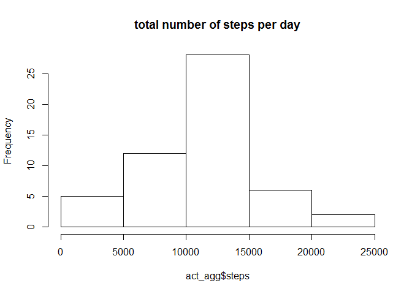
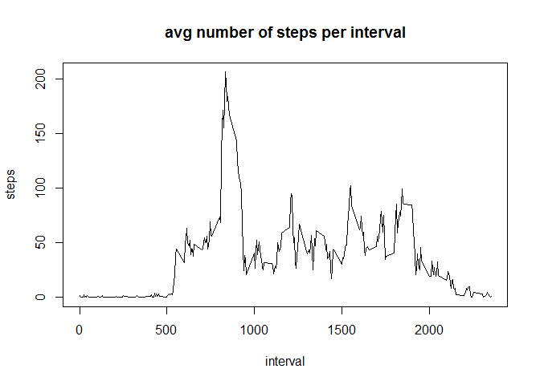
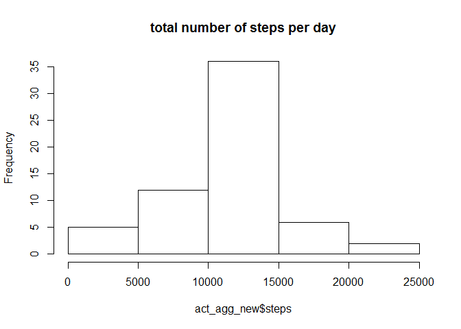
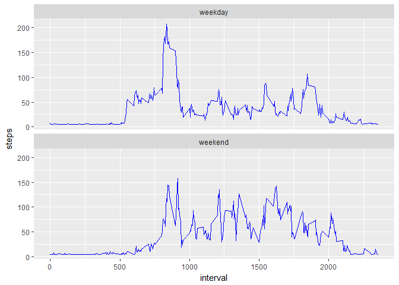

# Reproducible Research: Peer Assessment 1

Loading and preprocessing the data:

```r
act <- read.csv("activity.csv", colClasses=c("integer", "Date", "integer"))
```

Histogram of the total number of steps taken each day:

```r
act_agg<-aggregate(steps ~ date, act, sum)
hist(act_agg$steps, main="total number of steps per day")
```

<!-- -->

Mean and median number of steps taken each day:

```r
mean(act_agg$steps)
```

```
## [1] 10766.19
```

```r
median(act_agg$steps)
```

```
## [1] 10765
```

Time series plot of the average number of steps taken:

```r
act_avg<-aggregate(steps ~ interval, act, mean)
plot(steps ~ interval, act_avg, type="l", main="avg number of steps per interval")
```

<!-- -->

The 5-minute interval that, on average, contains the maximum number of steps:

```r
act_avg[which.max(act_avg[,2]),1]
```

```
## [1] 835
```

Use mean number of steps for missing data. Show missing values have gone:

```r
sum(is.na(act))
```

```
## [1] 2304
```

```r
act_new <- act
act_new$steps[is.na(act_new$steps)] <- mean(act_new$steps, na.rm = TRUE)
sum(is.na(act_new))
```

```
## [1] 0
```

Histogram of the total number of steps taken each day after missing values are imputed:

```r
act_agg_new<-aggregate(steps ~ date, act_new, sum)
hist(act_agg_new$steps, main="total number of steps per day")
```

<!-- -->

Mean and median number of steps taken each day after missing values are imputed:

```r
mean(act_agg_new$steps)
```

```
## [1] 10766.19
```

```r
median(act_agg_new$steps)
```

```
## [1] 10766.19
```

Panel plot comparing the average number of steps taken per 5-minute interval across weekdays and weekends:

```r
act_new$day<-as.factor(ifelse(weekdays(act_new$date)=="Saturday" | weekdays(act_new$date)=="Sunday", "weekend", "weekday"))
act_avg_new<-aggregate(steps ~ interval + day, act_new, mean)
library(ggplot2)
```

```
## Warning: package 'ggplot2' was built under R version 3.3.2
```

```r
qplot(interval, steps, data=act_avg_new, geom=c("line"))+facet_wrap(~day, ncol=1)+geom_line(color="blue")
```

<!-- -->
